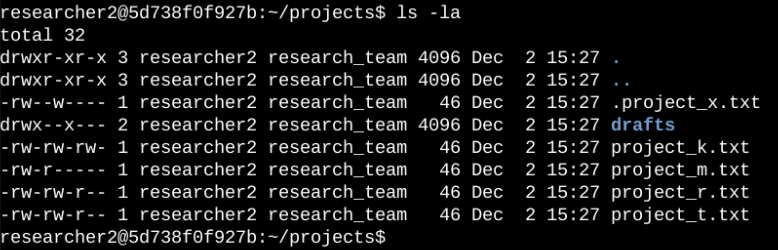
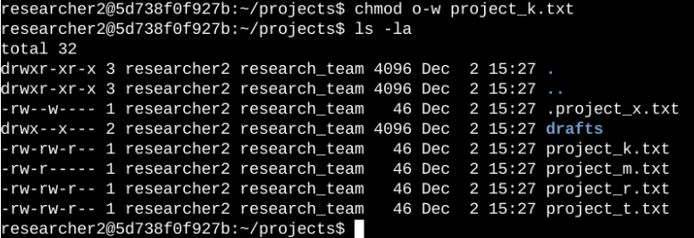
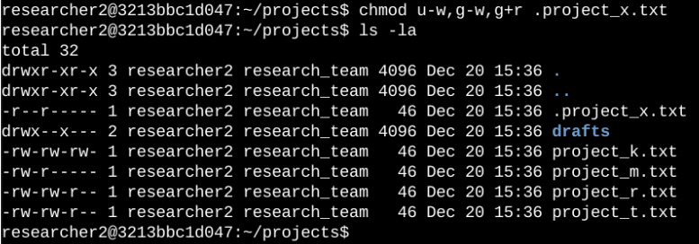
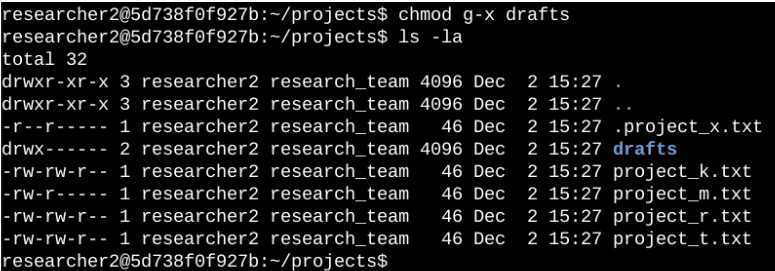

# Linux File Permissions Lab

## Overview

This lab demonstrates how Linux file and directory permissions can be inspected and modified using command-line tools.

The objective was to review existing permissions within a project directory and modify them according to the required access control policies.

This activity focuses on:

* Linux file and directory permissions
* Permission strings
* Users, groups, and others
* `ls -la`
* `chmod`
* Hidden files
* Directory access control
* Permission verification

---

## Objectives

By completing this lab, I practiced how to:

1. Inspect file and directory permissions.
2. Interpret Linux permission strings.
3. Modify file permissions using `chmod`.
4. Restrict write access for unauthorized users.
5. Configure permissions for hidden files.
6. Restrict access to a directory.
7. Verify permission changes using Linux commands.

---

## Environment

| Component        | Details                      |
| ---------------- | ---------------------------- |
| Operating System | Linux                        |
| Interface        | Command Line                 |
| Main Directory   | `/home/researcher2/projects` |
| Main Commands    | `ls -la`, `chmod`            |
| Permission Model | User / Group / Other         |

---

# 1. Check File and Directory Permissions

## Objective

The first step was to inspect the existing permissions within the `projects` directory.

### Command

```bash
ls -la
```

The `-l` option displays detailed information, while `-a` includes hidden files.

### Screenshot



### Example Output

```text
drwxr-x---  drafts
-rw-rw-r--  project_t.txt
-rw-rw-r--  project_k.txt
-rw-rw-r--  project_m.txt
-rw-rw-r--  project_r.txt
-rw-rw-r--  project_s.txt
-rw-rw-r--  .project_x.txt
```

The output shows the file type, permissions, owner, group, file size, and other file information.

---

# 2. Understanding the Linux Permission String

Linux permissions are represented by a 10-character string.

For example:

```text
-rw-rw-r--
```

The permission string can be divided into four sections:

```text
- rw- rw- r--
│ │   │   │
│ │   │   └── Other
│ │   └────── Group
│ └────────── User / Owner
└──────────── File type
```

### Permission Meaning

| Symbol | Meaning                |
| ------ | ---------------------- |
| `r`    | Read                   |
| `w`    | Write                  |
| `x`    | Execute                |
| `-`    | Permission not granted |

### Permission Categories

| Position | Category     |
| -------- | ------------ |
| 1        | File type    |
| 2–4      | User / Owner |
| 5–7      | Group        |
| 8–10     | Other        |

For example:

```text
-rw-rw-r--
```

means:

```text
User:  read + write
Group: read + write
Other: read
```

The file is a regular file because the first character is `-`.

---

# 3. Remove Write Permission from Other

## Objective

The organization required that users classified as `other` should not have write access to project files.

I identified `project_k.txt` as a file that had write permission granted to `other`.

### Before

```text
-rw-rw-rw- project_k.txt
```

The final `w` indicates that `other` users had write permission.

### Command

```bash
chmod o-w project_k.txt
```

Where:

* `chmod` → changes file permissions
* `o` → other
* `-w` → remove write permission

### Verification

```bash
ls -la project_k.txt
```

### After

```text
-rw-rw-r-- project_k.txt
```

Write permission has been removed from `other`.

### Screenshot



---

# 4. Modify Permissions for a Hidden File

## Objective

The file `.project_x.txt` had been archived.

The required access was:

* User → read
* Group → read
* Other → no write access

The file begins with `.` which means it is a hidden file in Linux.

### Command

```bash
chmod u-w,g-w,g+r .project_x.txt
```

This command:

* `u-w` → removes write permission from the user
* `g-w` → removes write permission from the group
* `g+r` → adds read permission to the group

### Verification

```bash
ls -la .project_x.txt
```

### Screenshot



### Result

The permissions were modified to reflect the required access level.

---

# 5. Restrict Directory Permissions

## Objective

The `drafts` directory should only be accessible by `researcher2`.

Other users should not have execute permission on the directory.

### Check Existing Permissions

```bash
ls -ld drafts
```

The `-d` option displays information about the directory itself rather than its contents.

### Permission Change

The group execute permission was removed:

```bash
chmod g-x drafts
```

### Verification

```bash
ls -ld drafts
```

### Screenshot



The resulting permissions were checked to confirm that unauthorized group access had been removed.

---

# 6. Troubleshooting & Verification

After making the changes, I used `ls -la` and `ls -ld` to verify that the permissions matched the required access controls.

### Verification Process

```text
Inspect permissions
       ↓
Identify incorrect permission
       ↓
Apply chmod
       ↓
Check permissions again
       ↓
Confirm expected result
```

This helped ensure that the changes were actually applied rather than assuming that the `chmod` command succeeded.

---

# 7. Key Commands

| Command                 | Purpose                                                     |
| ----------------------- | ----------------------------------------------------------- |
| `ls -la`                | List files including hidden files with detailed information |
| `ls -ld <directory>`    | Display permissions for a directory itself                  |
| `chmod o-w <file>`      | Remove write permission from other                          |
| `chmod u-w <file>`      | Remove write permission from user                           |
| `chmod g-w <file>`      | Remove write permission from group                          |
| `chmod g+r <file>`      | Add read permission to group                                |
| `chmod g-x <directory>` | Remove execute permission from group                        |

---

# 8. Security Concepts Demonstrated

This activity demonstrates several fundamental Linux security concepts:

### Least Privilege

Users should only receive the permissions required to perform their tasks.

### Access Control

File permissions determine which users can read, modify, or execute resources.

### User / Group Separation

Permissions can be assigned separately to the file owner, group, and other users.

### Permission Verification

Security configuration should be verified after changes to ensure that the intended access controls are actually enforced.

---

# 9. What I Learned

Through this activity, I strengthened my understanding of Linux access control and the `chmod` command.

I learned how to:

* Interpret Linux permission strings.
* Identify the owner, group, and other permission levels.
* Modify individual permissions using symbolic notation.
* Work with hidden files.
* Restrict directory access.
* Verify security configuration changes through the command line.

This activity also reinforced the importance of applying the principle of least privilege when managing access to files and directories.

---

## Conclusion

The exercise demonstrated how Linux file permissions can be reviewed and modified to enforce appropriate access controls.

By inspecting the existing configuration first, applying targeted permission changes, and verifying the results afterward, I was able to align the file and directory permissions with the organization's access requirements.
